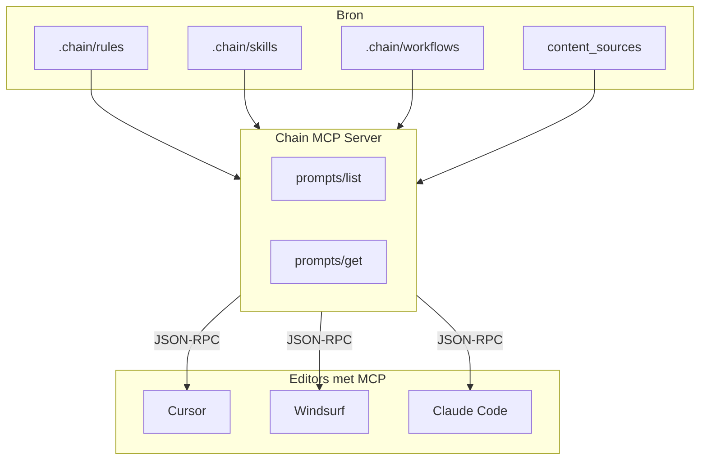

# Plan: Chain MCP Prompts Aanpak

> Doel: Chain rules, skills en workflows via MCP Prompts aanbieden aan AI-editors, als alternatief of aanvulling op file sync.

## Executive Summary

Chain bouwt een **ingebouwde MCP server** die `.chain/` content exposeert als MCP Prompts. Editors (Cursor, Windsurf, Claude, etc.) die MCP ondersteunen kunnen deze prompts laden zonder file sync. Dit elimineert duplicatie voor gebruikers die MCP Prompts prefereren.

**Belangrijk onderscheid**: MCP Prompts zijn **user-initiated** — de gebruiker selecteert ze expliciet (bijv. via @ of slash command). Ze vervangen niet automatisch de "always-on" file-based rules. Beide aanpakken zijn complementair.

---

## Architectuur



---

## MCP Prompts vs File Sync

| Aspect | File Sync | MCP Prompts |
|--------|-----------|-------------|
| **Duplicatie** | N×M bestanden (N content × M editors) | Geen — server leest direct uit .chain/ |
| **Activering** | Automatisch (editor laadt .cursor/rules/*) | Handmatig (user selecteert prompt) |
| **Sync nodig?** | Ja, bij elke wijziging | Nee — server leest live |
| **Editor support** | Alle (eigen format per editor) | Alleen MCP-clients (Cursor, Windsurf, Claude, etc.) |
| **Frontmatter** | Per editor (Claude, Windsurf, Trae) | Eén format — server kan adapter-logica toepassen |

**Aanbeveling**: Beide aanpakken naast elkaar. File sync blijft voor "always-on" rules; MCP Prompts voor on-demand of als primaire bron in MCP-first workflow.

---

## Prompt Structuur

### Optie A: Geaggregeerde prompts (eenvoudig)

| Prompt name | Beschrijving | Content |
|-------------|--------------|---------|
| `chain_all_rules` | Alle project rules | Alle rules uit .chain/rules/ geconcateneerd |
| `chain_all_skills` | Alle skills | Alle skills uit .chain/skills/ geconcateneerd |
| `chain_all_workflows` | Alle workflows | Alle workflows geconcateneerd |
| `chain_full_context` | Complete Chain context | Rules + skills + workflows + PROJECT.md |

**Voordeel**: Eén selectie geeft volledige context. **Nadeel**: Grote prompts, token-gebruik.

### Optie B: Per-file prompts (fijnmazig)

| Prompt name | Voorbeeld |
|-------------|-----------|
| `chain_rule_{name}` | `chain_rule_project_conventions` |
| `chain_skill_{name}` | `chain_skill_code_review` |
| `chain_workflow_{name}` | `chain_workflow_create_prd` |

**Voordeel**: User kiest precies wat nodig is. **Nadeel**: Meer prompts in de lijst.

### Aanbeveling: Hybride

- `chain_full_context` — alles in één (voor "load all" use case)
- `chain_rules`, `chain_skills`, `chain_workflows` — per categorie
- Optioneel: individuele prompts voor skills (vaak handmatig geselecteerd)

---

## Implementatie

### 1. Nieuwe dependency

```json
"dependencies": {
  "@modelcontextprotocol/sdk": "^1.0.0"
}
```

### 2. Module structuur

```
src/
├── mcp-server/
│   ├── index.ts           # Server entry, Stdio transport
│   ├── prompt-handlers.ts # prompts/list, prompts/get
│   ├── content-loader.ts  # Hergebruik resolveContentSources + merge
│   └── types.ts
```

### 3. Content loading

Hergebruik bestaande logica:

- [`resolveContentSources`](src/sync/content-resolver.ts) — content uit .chain/ + content_sources
- Merge met lokale .chain/ (lokale override)
- Zelfde volgorde als sync: external first, dan local

### 4. Server lifecycle

```typescript
// prompts/list
// - Scan .chain/ + content_sources
// - Return prompt definitions (name, title, description)

// prompts/get
// - Load content voor gevraagde prompt
// - Return messages: [{ role: "user", content: { type: "text", text: "..." } }]
```

### 5. CLI entry point

```bash
npx @silverfox14/chain mcp-server
# Of als subcommand:
chain mcp-server
```

Server draait via Stdio; editors starten hem als subprocess via mcp.json.

### 6. chain init integratie

`chain init` voegt de Chain MCP server toe aan `chain.yaml`:

```yaml
mcp_servers:
  - name: chain
    command: npx
    args: ["-y", "@silverfox14/chain", "mcp-server"]
    env:
      CHAIN_PROJECT_ROOT: .   # Of absolute path
```

`generateMCPConfigs` schrijft dit naar .cursor/mcp.json, .claude/settings.json, etc.

**Uitdaging**: `CHAIN_PROJECT_ROOT` moet de project root zijn. Oplossing: `process.cwd()` wanneer de editor de server start (editor opent project root), of expliciet pad in args.

**Handmatige config** (MVP): Voeg toe aan `.cursor/mcp.json` of `chain.yaml` mcp_servers:

```yaml
mcp_servers:
  - name: chain
    command: npx
    args: ["-y", "@silverfox14/chain", "mcp-server"]
```

De server start vanuit de project root (waar de editor opent). Run `chain sync` om mcp.json te genereren als die nog niet bestaat.

---

## Configuratie

### chain.yaml uitbreiding

```yaml
# Optioneel: MCP server configuratie
mcp:
  chain_server:
    enabled: true
    prompts:
      - full_context    # chain_full_context
      - by_category     # chain_rules, chain_skills, chain_workflows
      - individual      # chain_rule_*, chain_skill_* (optioneel)
```

Standaard: `full_context` + `by_category`.

---

## Sync Mode Opties

| Mode | Beschrijving |
|------|--------------|
| `file` (default) | Alleen file sync — huidig gedrag |
| `mcp` | Alleen MCP server — geen file sync |
| `hybrid` | Beide — file sync + MCP server |

`chain init` kan vragen: "Use MCP Prompts for rules? (reduces file sync)" — bij Yes: `sync_mode: hybrid` of `mcp`.

---

## Editor Support

| Editor | MCP | Prompts support |
|--------|-----|-----------------|
| Cursor | ✅ | ✅ (Guidelines) |
| Windsurf | ✅ | ✅ |
| Claude Code | ✅ | ✅ |
| Kiro | ✅ | Onbekend |
| Trae, Gemini, etc. | Varieert | Varieert |

Editors zonder MCP: file sync blijft nodig.

---

## Risico's en Onzekerheden

1. **Prompts = user-initiated**: Gebruiker moet prompt selecteren. Geen "always-on" zoals file rules. Onderzoek of Cursor/Windsurf MCP Prompts als default guidelines kunnen laden.

2. **Token limits**: `chain_full_context` kan groot worden. Overweeg truncatie of "recent N rules" optie.

3. **Server startup**: Editor moet server starten. `npx -y` kan eerste keer traag zijn. Overweeg `bunx` of pre-installed chain.

4. **content_sources**: Server moet alle content_sources resolven. Zelfde logica als sync — hergebruik.

5. **Overrides**: Editor-specifieke overrides (.chain/overrides/cursor/) — hoe in MCP? Optie: negeer voor MCP (universele content) of voeg `chain_rules_cursor` prompt toe.

---

## Fasering

### Fase 1: MVP (2–3 dagen)

- [x] `@modelcontextprotocol/sdk` toevoegen
- [x] `src/mcp-server/` met prompts/list en prompts/get
- [x] Vier prompts: `chain_full_context`, `chain_rules`, `chain_skills`, `chain_workflows`
- [x] `chain mcp-server` CLI command
- [x] Handmatige config in chain.yaml (geen auto-add bij init)
- [ ] Test met Cursor

### Fase 2: Integratie (1–2 dagen)

- [ ] chain init voegt Chain MCP server toe (opt-in)
- [ ] generateMCPConfigs: Chain server in mcp_servers als enabled
- [ ] content_sources hergebruik in content-loader
- [ ] PROJECT.md in chain_full_context

### Fase 3: Verfijning (optioneel)

- [ ] Individuele prompts per rule/skill
- [ ] listChanged notificatie bij file watcher
- [ ] sync_mode: mcp | hybrid
- [ ] Overrides support

---

## Success Criteria

- [ ] `chain mcp-server` start en reageert op prompts/list en prompts/get
- [ ] Cursor toont Chain prompts in UI (bij @ of prompts panel)
- [ ] chain_full_context retourneert correcte merged content
- [ ] Geen file sync nodig voor MCP-only gebruikers
- [ ] Bestaande file sync blijft ongewijzigd (backward compatible)
